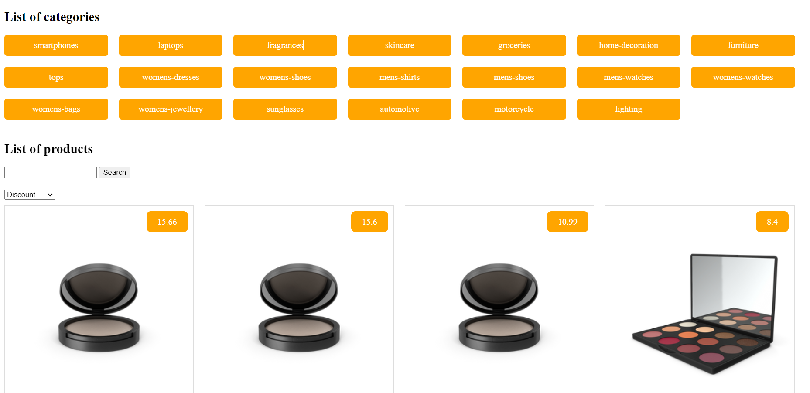

<div align="center">
  <h1>Product List Page</h1>
</div>

## Purpose

This project is designed to practice and enhance your skills with vanilla JavaScript by implementing various essential features on a product listing page. It provides a hands-on approach to learning how to manipulate the DOM, handle events, and interact with APIs.

## Features

The product listing page includes the following features:

1. **Display Product List**

   - Fetch and display all available products from a given dataset or API.

2. **Search Products**
   - Implement a search bar that allows users to search for products by keywords.
3. **Paginate Products**
   - Split the product list into multiple pages to improve usability and performance.
   - Provide navigation controls for users to switch between pages.
4. **Sort Products**
   - Allow users to sort products based on various criteria:
     - **Default**: The initial sorting order.
     - **Price low to high**: Products are sorted from the lowest to the highest price.
     - **Price high to low**: Products are sorted from the highest to the lowest price.
     - **Most discounted**: Products are sorted based on the highest discount percentage.
5. **Display Product Categories**
   - Show a list of product categories.
   - Filter and display products based on the selected category.

## Image Demo



## Installation and Usage

### Prerequisites

Ensure you have a modern web browser installed.

### Clone the Repository

To get started, clone the repository to your local machine:

```bash
git clone <repository_url>
cd <repository_directory>
```
